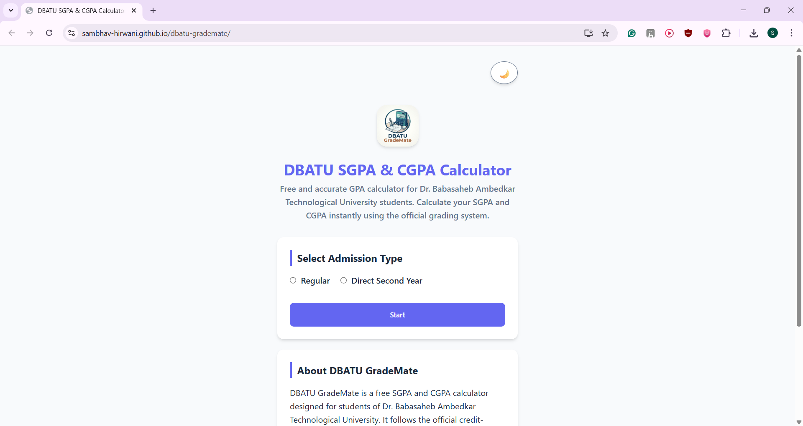
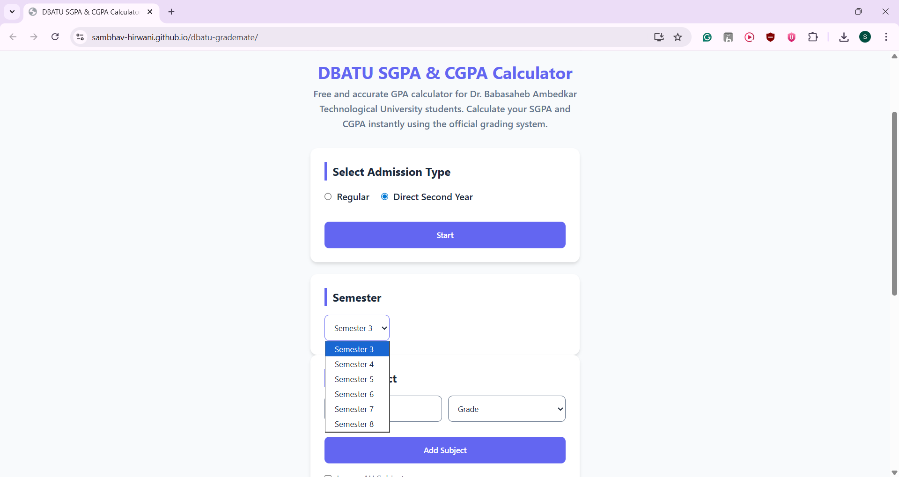
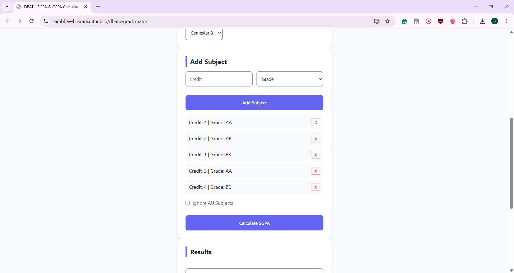
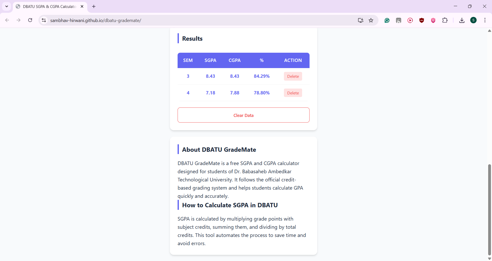
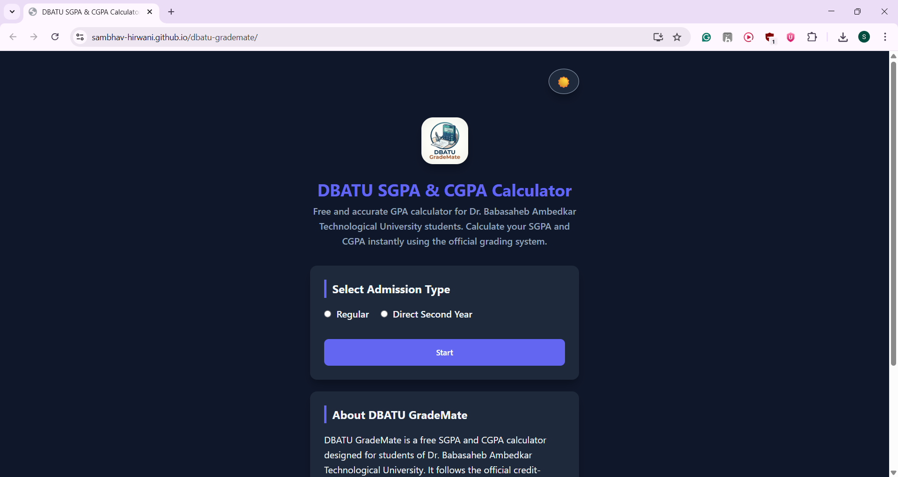
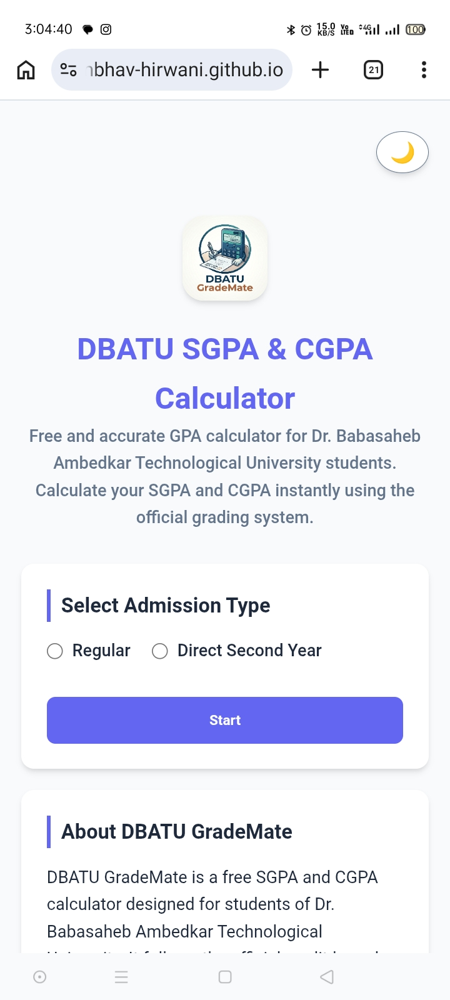
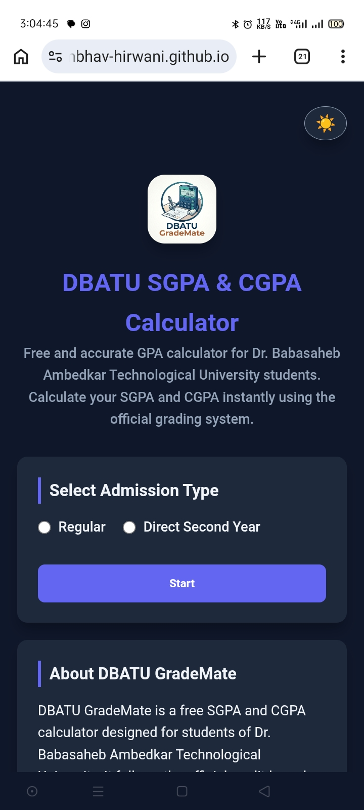
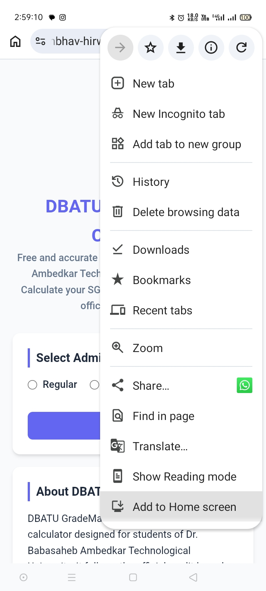
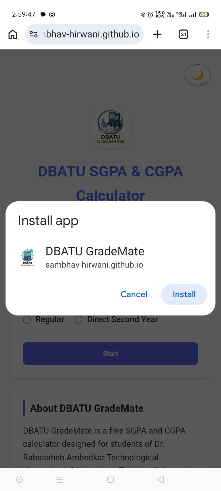

# 🚀 DBATU GradeMate – SGPA & CGPA Calculator for DBATU Students

A **free SGPA and CGPA calculator for DBATU (Dr. Babasaheb Ambedkar Technological University)** students.
This Progressive Web App (PWA) helps you accurately calculate semester GPA, overall CGPA, and academic performance using the official DBATU credit and grading system.

---

## 🌐 Live Demo

👉 https://sambhav-hirwani.github.io/dbatu-grademate/

---

## 🎯 Keywords

DBATU SGPA calculator, DBATU CGPA calculator, DBATU GPA calculator, engineering CGPA calculator, Maharashtra engineering GPA tool, DBATU result calculator

---

## 📌 Features

* 📊 **SGPA Calculator for DBATU**
  Calculate semester GPA using subject-wise credits and grades

* 🎓 **CGPA Calculator for Engineering Students**
  Track overall academic performance across semesters

* 🔄 **Direct Second Year (DSY) Support**
  Supports lateral entry students

* 🧮 **Backlog / AU Handling**
  Handles absent and failed subjects correctly

* 📱 **Mobile-Friendly Responsive Design**
  Works smoothly on phones and desktops

* ⚡ **Offline Support (PWA)**
  Installable web app that works without internet

---

## 📷 Screenshots

### 🏠 DBATU GradeMate Home Interface



---

### 📊 Admission type & Semester Selection



---

### 📊 Add Subjects & Credits



---

### 📊 SGPA / CGPA / Percentage Result Output



---

### 🌙 Dark Mode UI



---

### 📱 Mobile Responsive View

<p align="center">
  
  
</p>

---

### ⚡ Install as App (PWA)

<p align="center">
  
  
</p>

---

## 🛠 Tech Stack

* HTML5
* CSS3
* JavaScript (Vanilla)
* Service Workers (PWA)

---

## ⚙️ How to Use DBATU GradeMate

1. Select your semester
2. Enter subject credits and grades
3. View your SGPA instantly
4. Add multiple semesters to calculate CGPA

---

## ⚙️ Run Locally

```bash id="u6p7iv"
git clone https://github.com/sambhav-hirwani/dbatu-grademate.git
cd dbatu-grademate
```

Open:

```bash id="3q9w7x"
index.html
```

---

## 📦 Install as App (PWA)

1. Open the app in browser
2. Click **Install App / Add to Home Screen**
3. Use it offline anytime

---

## 🎯 Future Improvements

* 🎯 Target CGPA Predictor
* 📈 Performance Analytics
* 🎨 UI/UX Enhancements
* 📊 Smart Grade Insights

---

## 📄 License

MIT License

---

## 👨‍💻 Developer

**Sambhav Hirwani**
GitHub: https://github.com/sambhav-hirwani
